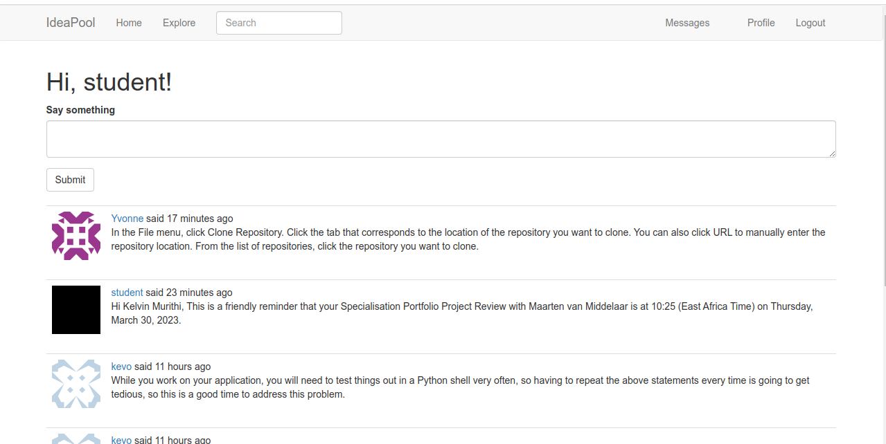

# IdeaPool

[!IdeaPool](https://github.com/Kelvintrc/IdeaPool)

## Project Discription

The project is a blogging web application. It involves the sharing of ideas online by developers especially Kenyan self-paced developers trying to learn software Engineering concepts through a flask blog app. It involves the design, implementation, and maintenance of an online Flask blog app. The system solves the problem of newbies and developers who need to share and maybe acquire some ideas through the blog app. Here all of them can interact and share ideas freely and conveniently.

## How To Use

+ Clone this repository and build the project using Visual Studio or any text editor of your choice.
+ If you are using the terminal cd into "IdeaPool" directory.
+ Run the following code on your terminal "pip install -r requirements.txt" to install all the project dependancies
+ Type the following on the terminal "export FLASK_APP=ideapool.py" and press Enter
+ Then, "flask run" and press Enter
+ This will open the development server and you will be able to access the project on your browser using the following address "http://127.0.0.1:5000/index"

